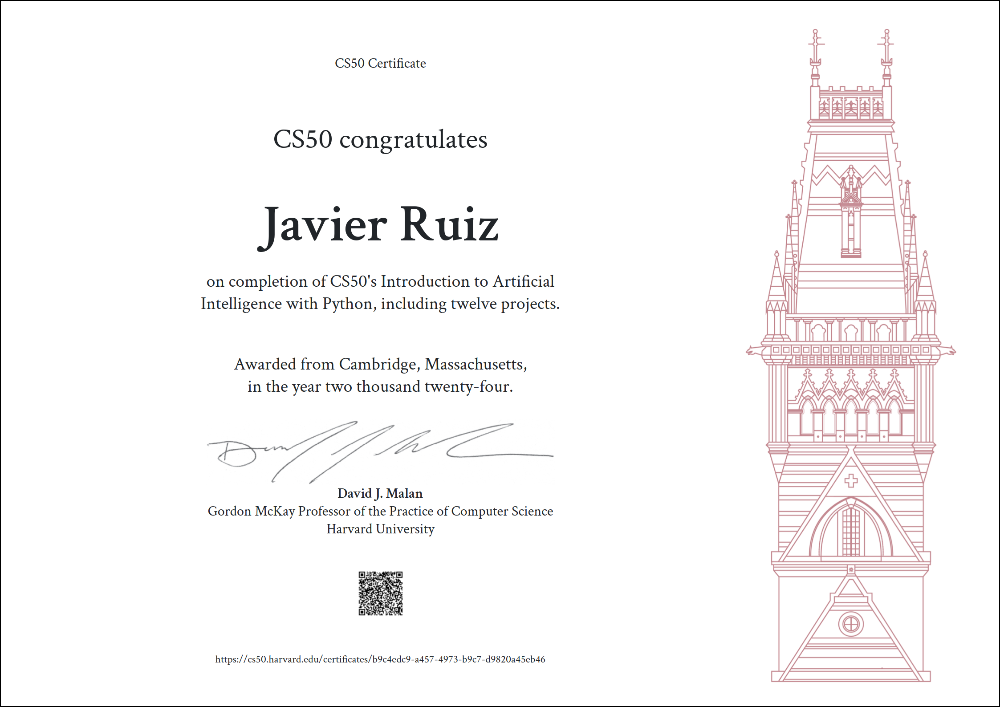

# PORFOLIO

## Un amor de juventud recuperado

Mi proyecto fin de carrera fue el desarrollo en C de un evaluador de expresiones lógicas parte de un sistema experto. La primera etapa profesional siguó ceñida al desarrollo, pero pronto derivó por otros derroteros.

Hace tres años, jefaturas de varias Direcciones de Provisión se transforman y nos reubican a la mayoría  de los Jefes de Proyecto. Mi nueva jefatura controla y gestiona la renovación de pedidos a provedores; solicitamos al Departamento de Compras el lanzamiento de pedidos, previo análisis de ciertos datos.

Veo la oportunidad de recuperar mi pasion por el desarrollo de SW. Voy sustituyendo estos procesos, fundamentalmente manuales, por scripts python. En un  entorno muy dinámico que me enfrenta a la labor de mantenimiento y depurado constante de mi propio SW. Disfruto mucho con ello.

## Scraping de Intranet.

Mis primeros scripts recogen datos de la Intranet mediante técnicas de scraping, y una vez definido el pedido, solicita su lanzamiento inyectando los formularios  correspondientes en la Intranet. Creo una librería propia y la utilizo para resolver la tarea frecuente de analizar y lanzar pedidos cuyos datos básicos se encuentran en un excel y se complementan en la Intranet. Disminuye así considerablemente la posibilidad de errores de tareas manuales notablemente laboriosas.

Como es común en los desarrollos de scraping, es necesario rehacer partes de la librería ante ciertas modificaciones de la Intranet. Tener que mantener código olvidado hace meses, acentúa la importancia de una adecuada documentación.

#### librerías python utilizadas:
- beautifulsoup
- requests
- openpyxl
- os
- sys
- colorama
- mi propia librería de scraping Intranet

#### Utilidades usadas:
- BURP Community Suite

## Análisis con Pandas de volcados masivos a excel.

En cierta etapa, se despliega como herramienta estratégica en la compañía Power BI. La jefatura empieza a generar informes con ella como base de nuestra labor diaria. Lo hace importando ficheros excel volcados a diario desde la base de datos de la Intranet. Descubro así que puedo acceder a muchos de los datos que necesito, directamente de estos ficheros.

Refactorizo gran parte de las consultas en mi librería. Sustituyo el scraping (relativamente lento) por el tratamiento de estos ficheros excel. Elijo utilizar la librería pandas, dada su potencia para el cruzado de datos, su capacidad de manejar volúmenes elevados (comno es el caso), y su rapidez de ejecución.

Sobre la nueva librería desarrollo scripts que, tras una pesada carga inicial de datos, proporcionan consultas muy rápidas y completas sobre casi todos los datos relevantes que utilizo. También generan informes en excel que son base de diversos scripts de análisis y generación de pedidos. El rendimiento en mi día a día se dispara.

#### librerías python utilizadas:
- pandas
- os
- sys
- colorama
- openpyxl

## Versión OOP de la librería de scraping

Cuando dispongo de cierta estabilidad y tiempo, decido refactorizar mi librería de scraping para escribirla completamente orientada a objetos. Diseño una jerarquía de clases que me permitirá abordar de forma eficiente el scraping de otros formularios de la Intranet en el futuro.

## Script de análisis histórico

Disfrutando de la programación completamente orientada a objeto sobre mi nueva librería, construyo scripts que gestionan el análisis de pedidos de una forma más exhaustiva, al disponer ágilmente de datos históricos. Con ello automatizo nuevas tareas que se nos han ido asignando.

## Evolución hacia nuevo sistema de pedidos

La estructura de datos de intercambio para las solicitudes de pedidos sufre una modificación importante, como consecuencia de una reestructuración en el grupo de empresas. Participo en el proyecto de migración los pedidos a caballo entre los dos sistemas. Y nuevamente, mis scripts me permiten hacer verificación, análisis y transformación de datos de forma fiable y mucho mas eficiente.

## Rozo SQL

Todo esto ocurre mientras se está implantando SAP for Hanna de forma masiva para gestionar el end-to-end. El sistema de gestion cambia completamente; desaparece la antigua Intranet, y el modelo de datos cambia notablemente. Consigo acceso a una réplica de la nueva base de datos corporativa, pero aun sin su especificación. Empiezo a jugar con pyodbc (SQLite) en mis scripts mientras accedo con SQLServer a unos datos de cuya documentación no disponemos, lo que me impide poder realizar desarrollos mínimamente útiles.

Y entretanto llega la oportunidad de salir de mi empresa en condiciones favorables, y así poder orientar mi carrera profesional en el campo del desarrollo, que abrazo como se merece un amor de juventud.

## Formación

Tras mi salida de la empresa, consciente de la necesidad de formarme continuamente, realizo estos cursos:

### **HarvardX: "CS50's Introduction to Artificial Intelligence with Python" (OJO VERSION INGLES PARA CV EN INGLES**

Contenido del curso: 
https://pll.harvard.edu/course/cs50s-introduction-artificial-intelligence-python

Certificado de realización:

(Verificable en: 
https://cs50.harvard.edu/certificates/b9c4edc9-a457-4973-b9c7-d9820a45eb46)

### **IBM Git&GitHub Basics**

Contenido del curso: 
https://www.edx.org/es/learn/github/ibm-git-and-github-basics

Certificado de realización: 
**(pendiente)**

